# **PetGPT 🐶😸**

&nbsp;

## 🎬 시연 영상 : [보러가기](https://youtu.be/TC6imI03gOo?si=y3hOOb1dPAONwuw6)

PM (Project Manager): 김민주  
DEV: 강성경, 김현호, 김상우, 김준서  
기간: 2025.03.24 ~ 2025.05.31

&nbsp;

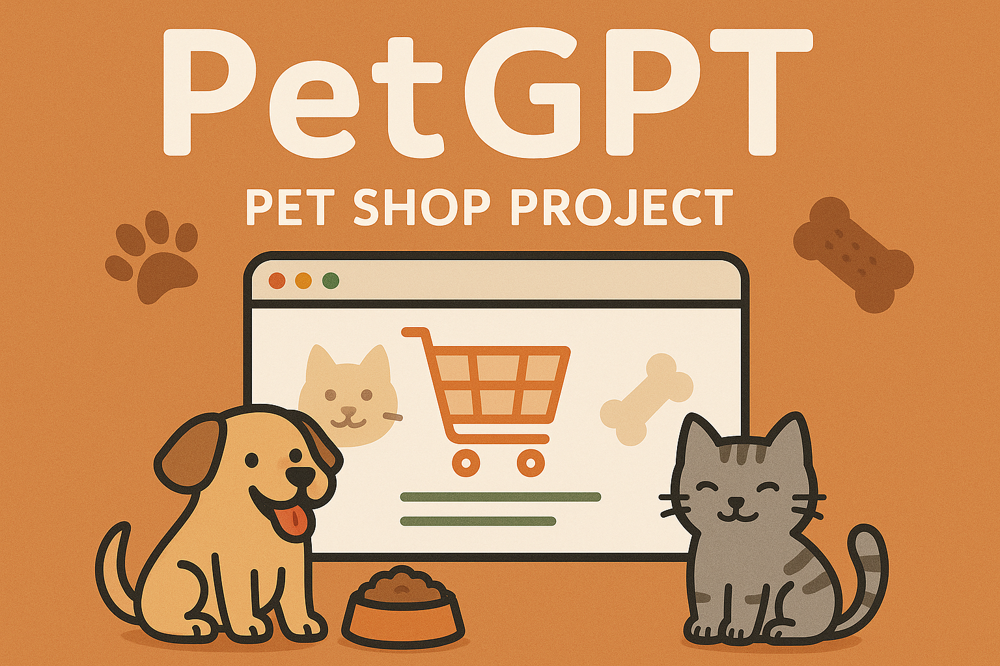

&nbsp;

<div align="center">
  
| 분류       | 기술 스택 |
| ---------- | ---------- |
| **개발 언어** |     |
| **프레임워크 & 라이브러리** |     |
| **IDE** |  |
| **협업 도구** |      |
| **DB** |  |
| **API** |   |
| **서버 배포** |  |

</div>

&nbsp;

## **✨ 프로젝트 소개**

### 주제

```
AI 서비스 기반 반려동물 쇼핑몰: RAG 챗봇 상담 및 이미지 인식, 화면 인식 등 편의 기능을 제공합니다.
```

&nbsp;

### 기획의도

반려동물 양육 인구가 급증함에 따라 관련 용품 시장도 빠르게 성장하고 있지만, 수많은 상품 정보 속에서 내 반려동물에게 꼭 필요한 제품을 찾기란 쉽지 않습니다. 특히 처음 반려동물을 키우거나 특정 상황(질병, 알레르기 등)에 놓인 보호자들은 어떤 기준으로 상품을 선택해야 할지 막막함을 느끼곤 합니다.

**PetGPT**는 이러한 정보 비대칭 문제를 해결하고, 보호자들이 더욱 편리하고 현명하게 쇼핑할 수 있는 환경을 제공하고자 기획되었습니다. RAG(Retrieval Augmented Generation) 기반 AI 챗봇 상담과 이미지 인식을 통한 품종 분석 등 AI 편의 기능을 통해 고객 맞춤형 쇼핑 경험을 제공합니다.

&nbsp;

## **🛠️ 기술 스택**

| 구분          | 내용                                                                                             |
| :------------ |:-----------------------------------------------------------------------------------------------|
| **IDE**       | IntelliJ IDEA, Visual Studio Code, Cursor                                                      |
| **Language**  | Java, JavaScript, Python                                                                       |
| **Framework** | Spring Boot, MyBatis, JSP (View)                                                               |
| **Database**  | MySQL, Pinecone                                                                                |
| **Server**    | Apache Tomcat, Naver Cloud Platform                                                            |
| **VCS**       | Git, GitHub                                                                                    |
| **APIs**      | 카카오 소셜 로그인 API, 카카오 맵 API, 아임포트 결제 API, Google Cloud Vision API, Google Gemini API, OpenAI API |
| **Tools**     | ERDCloud, Slack, Notion, Miro                                                                  |
| **기타**      | LangChain                                                                                      |

&nbsp;

## **✨ 구성원 및 역할**

| 구분        | 내용                                                                                                                                                                                                          |
|:----------|:------------------------------------------------------------------------------------------------------------------------------------------------------------------------------------------------------------|
| **강성경**   | (관리자 페이지) 회원관리, 후기 및 문의글 관리, 영상 촬영                                                                                                                                                                          |
| **김민주**   | (서비스 페이지) 메인화면 구현, 로그인 및 회원가입, 마이페이지, 1:1 문의게시판,  펫 정보 등록 및 맞춤 상품추천, 배송지 등록/수정, 주문 및 결제, 주문내역 관리, 작성한/작성해야할 리뷰, 쿠폰/적립금 조회 및 사용, 핫딜 알림, 날씨API활용한 문구 표시, footer, 내가 찜한 상품, 최근 본 상품, 영상 촬영 및 편집                |
| **김상우**   | (관리자 페이지) 인터셉터, 로그인, 주문/환불/배송관리,영상 촬영                                                                                                                                                                       |
| **김준서**   | (관리자 페이지) 메인화면 구현, 인터셉터, 로그인, 상품관리, 이벤트 및 공지사항, 나이대/성별 기준 판매량 차트, 실시간 매출현황, 데이터 통계 차트, 프론트엔드 테마, 영상 촬영 및 TTS, 발표                                                                                            |
| **김현호**   | (서비스 페이지) 메인화면 구현, 소셜 로그인, 상품 리스트 및 상세페이지, 옵션 선택 및 장바구니, 커뮤니티 게시판(글/댓글 작성, 좋아요), Google Cloud Vision API 품종분석, 웹소켓 활용 실시간 채팅상담, 타임딜 이벤트, 오프라인 매장 표기(about us), PetGPT(LLM챗봇), AI어시스턴트 팝업, 영상 촬영, PPT제작 및 발표 | |

&nbsp;

## **🗺️ 프로젝트 로드맵**

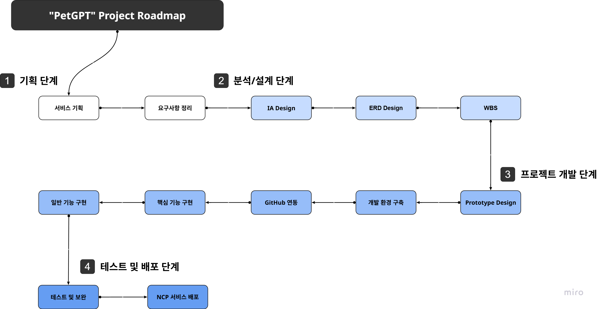

&nbsp;

## **📚 RAG 시스템 아키텍처 다이어그램**

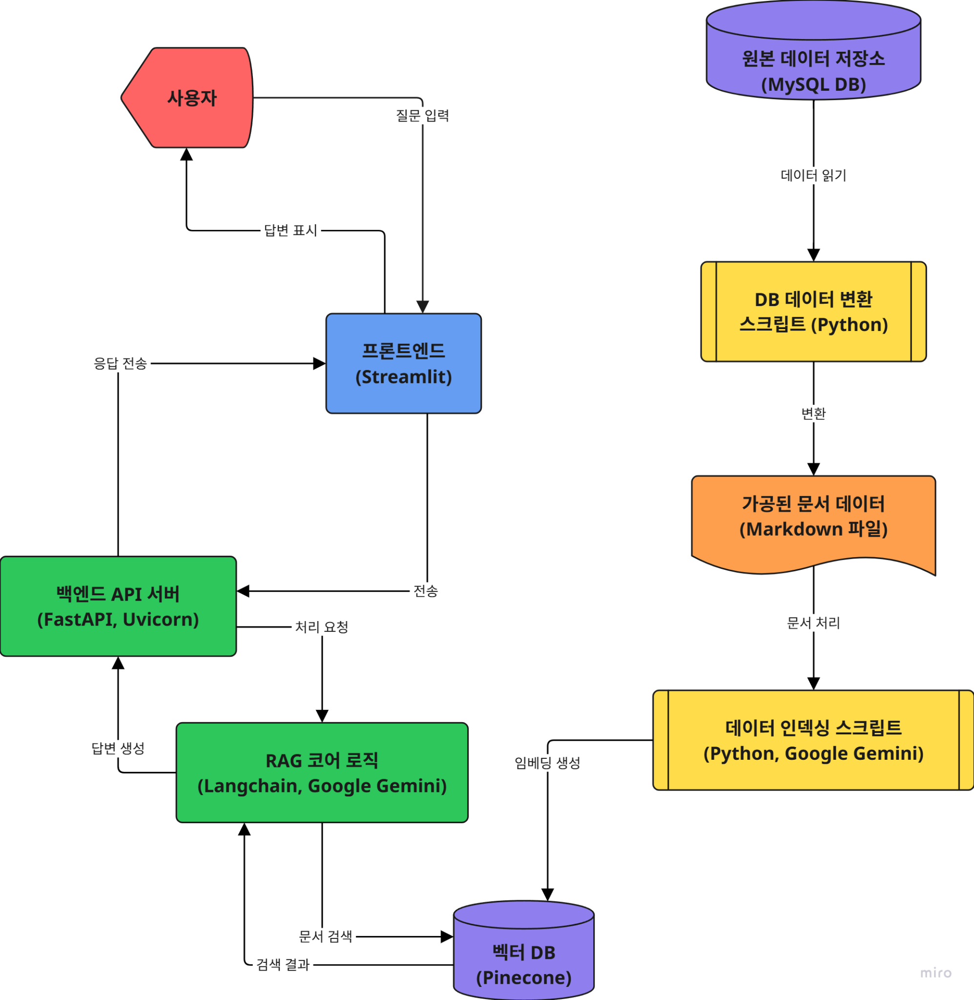

&nbsp;

## **🗂️ ERD (데이터베이스 설계)**

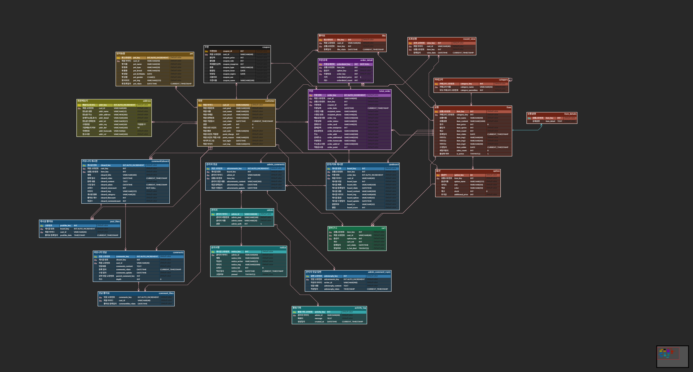

&nbsp;

## **✨ 주요 기능**

### **🙋‍♀️ 사용자 페이지**

1. **상품 관리**

- **상품 상세 조회**: 카테고리별 상품 조회, 상품 상세 정보 확인 기능
- **필터링**: 다양한 조건 (가격, 사이즈, 색상 등)으로 상품 필터링
- **정렬**: 최신순, 오래된순, 가격 높은순/낮은순, 판매량순, 할인율순 등 다양한 기준으로 상품을 정렬
- **검색**: 상품명 키워드 검색

&nbsp;

2. **커뮤니티**

- **정렬**

  

  &nbsp;

- **게시글 작성/수정/삭제**: Summernote 에디터, Papago API를 이용한 텍스트 번역 기능, 게시글 이미지 업로드 기능

  

  

  &nbsp;

- **댓글**: 게시글에 대한 댓글 작성, 수정, 삭제, 좋아요 기능

  

&nbsp;

3. **비밀번호 찾기/재설정**

- 이메일 인증을 통한 비밀번호 재설정

&nbsp;

4. **RAG 기반 AI 챗봇 상품 추천 및 상담**

- [챗봇\_readme](./chatbot-readme.md)

&nbsp;

- 쇼핑몰 내부 상품 정보, 고객 리뷰, 쇼핑몰 정책 등을 학습한 AI 챗봇
- 고객 질문 의도 파악 및 맞춤형 상품 추천, 상품 비교, 관련 고객 리뷰 등 상세 답변 실시간 제공

  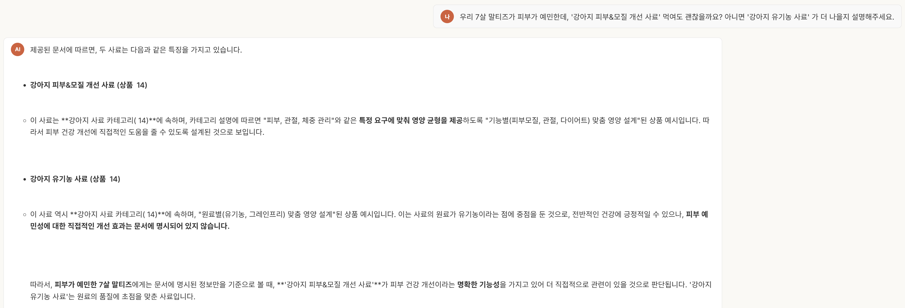

  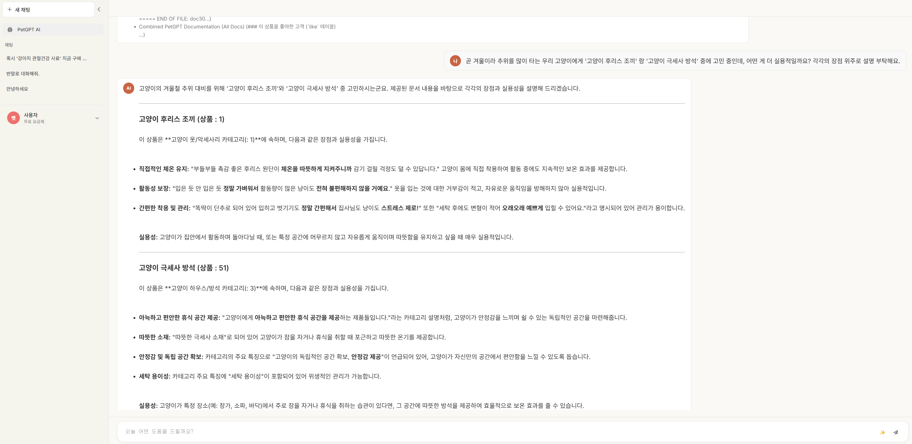

  

  &nbsp;

- 애매하거나 의외의 질문에 대한 예외 처리 능력

  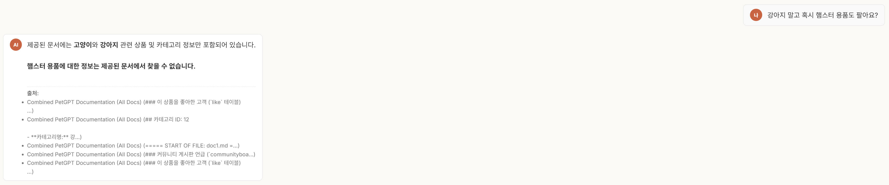

  &nbsp;

- 의학적 질문에 대한 책임 회피 능력

  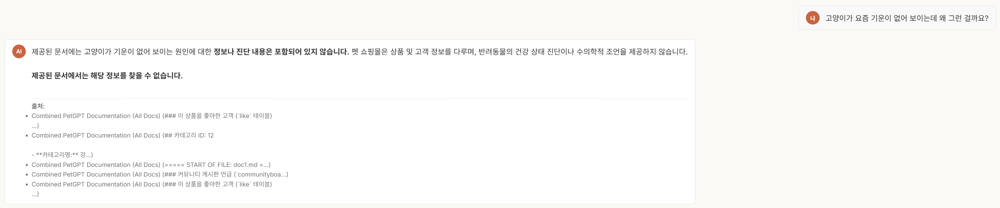

  &nbsp;

- 채팅 목록 저장 및 세션에 대한 대화 맥락 유지 능력

  

  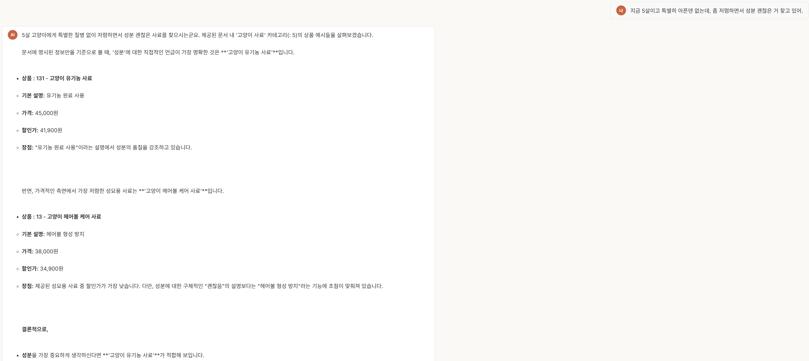

  &nbsp;

5. **AI 어시스턴트 팝업**

- [AI\_어시스턴트\_팝업\_readme](./assistant-popup.md)


&nbsp;

6. **Google Cloud Vision API 활용 품종 분석**

- 사용자가 업로드한 반려동물 사진 분석하여 크기, 성격, 털관리, 활동량 4가지 정보 제공


&nbsp;

7. **카카오 API 연동 (소셜 로그인, 지도 기반 서비스)**

   - 카카오 계정을 통한 간편 로그인

     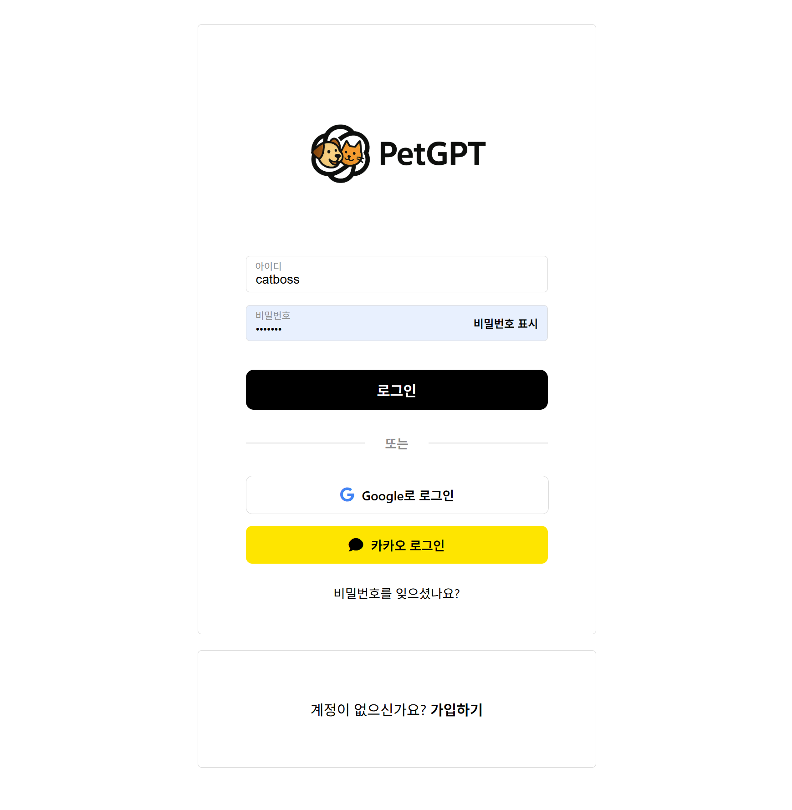

     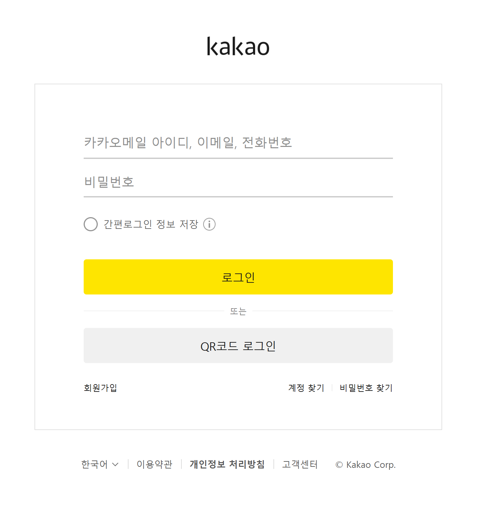

     &nbsp;

   - 카카오 맵 연동으로 "내 주변 매장 찾기" 검색 서비스

     

&nbsp;

8. **아임포트 API 활용 간편 결제 시스템**
   - 주문시에는 포인트 및 쿠폰 사용 가능
   - 다양한 결제 수단을 통한 안전하고 빠른 결제 지원
     
     

&nbsp;

9. **실시간 채팅 상담 (WebSocket 활용)**

   - 사용자와 관리자 간 실시간 양방향 소통이 가능한 채팅 기능
   - 이를 통해 고객 문의에 대한 즉각적인 응대가 가능

   

&nbsp;

10. **스케줄러를 활용한 타임딜 이벤트**

    - 지정된 시간에 특정 상품을 할인된 가격으로 제공하는 타임딜 기능을 스케줄러를 통해 자동화
    - 주기적인 이벤트를 효율적으로 운영하고 사용자의 구매를 유도

      

&nbsp;

11. **다크 모드/라이트 모드**: UI 테마 변경 기능

    

&nbsp;

12. **날씨알림**

- OpenWeatherMap API를 활용해 실시간으로 날씨를 보여주고, 그에 따라 강아지 산책관련 문구를 출력

  

13. **반응형 디자인**

    

### **👨‍💼 관리자 페이지**

1. **관리자 로그인및 메인화면**

   - 관리자 로그인
   - 디자인 : 다크모드/라이트모드, 메뉴별 사계절 테마 적용
   - shop 데이터 통계 - 전체 사용자 수 , 전체 상품 수 ,오늘 가입자 수, 총 주문수
     총 매출액 , 배송상태, 최근 7일 매출 추이, 카테고리별 판매 통계
   - 상품판매량 Top 10순위, 관리자 공지사항, 최근 주문내역, 최근 문의사항

     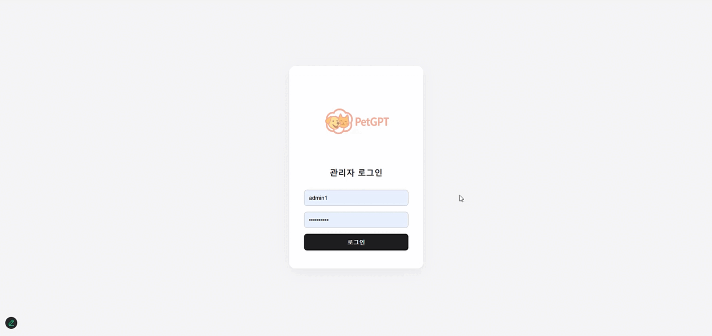

     &nbsp;

2. **사용자(고객 관리)**

   - 회원 정보 조회 및 관리
     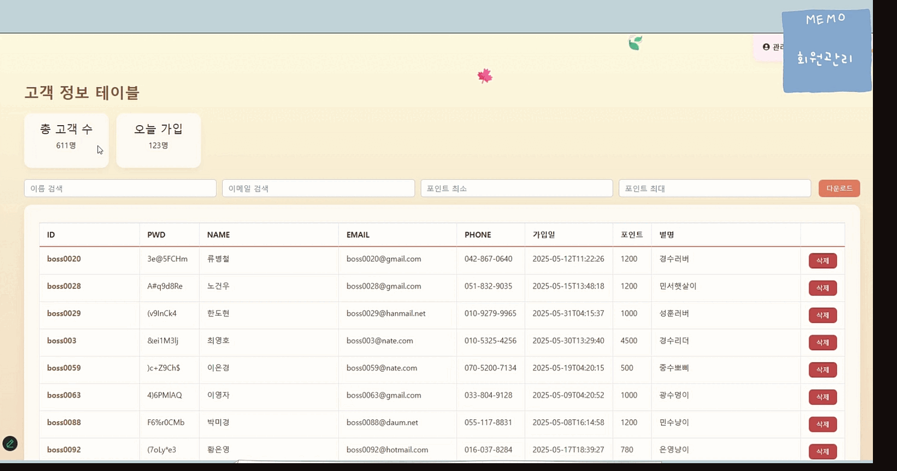

     &nbsp;

3. **상품 및 재고 관리 (CRUD)**

   - 상품 정보 등록, 수정, 삭제 기능
   - 실시간 재고 현황 파악 및 관리
   - 상품별 문의글 보기
     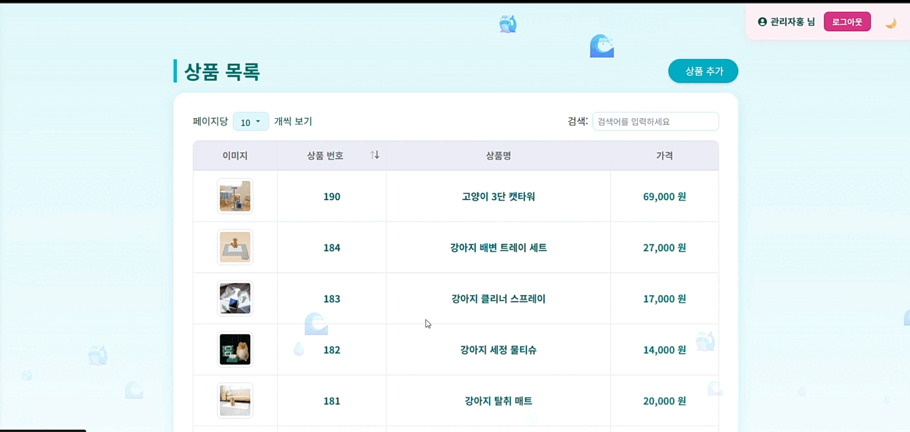

     &nbsp;

4. **주문 및 배송 관리**

   - 주문 내역 확인 및 상태 변경 (결제 완료, 배송 중, 배송 완료 등)
     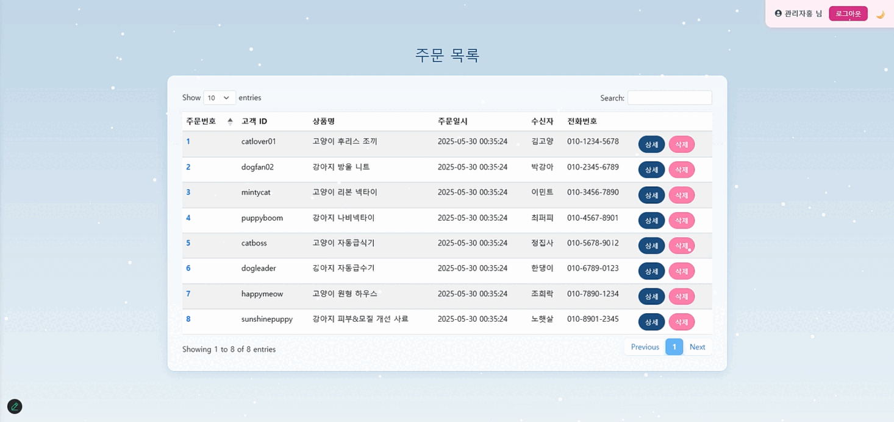

     &nbsp;

5. **문의글 관리**

   - 상품 문의 게시판
   - 답변글 등록, 수정, 삭제
   - AI 자동응답제안 - 자동 응답 생성
     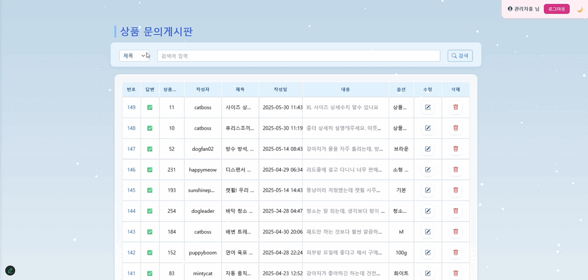

     &nbsp;

6. **공지관리**

   - 관리자 공지사항 등록, 수정, 삭제 관리
   - CKEditor API사용
     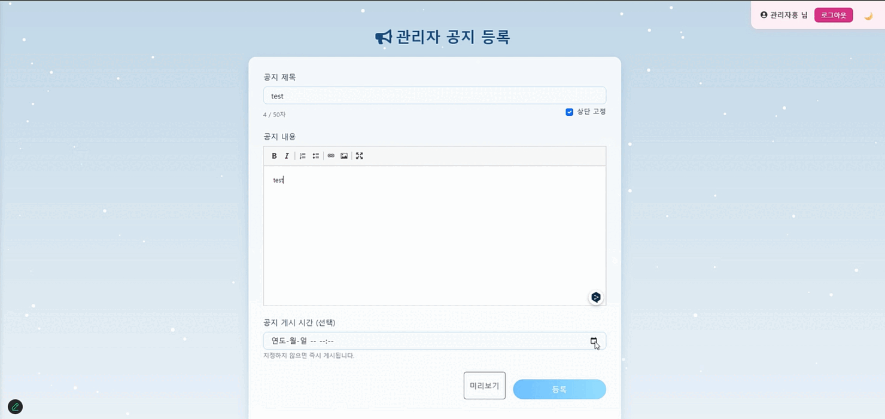

     &nbsp;

7. ** 사이트 통계 **
   - 매출, 고객변동, 상품별 판매량 등 주요 지표 시각화
   - 지역별 매출 Kakaomap API
     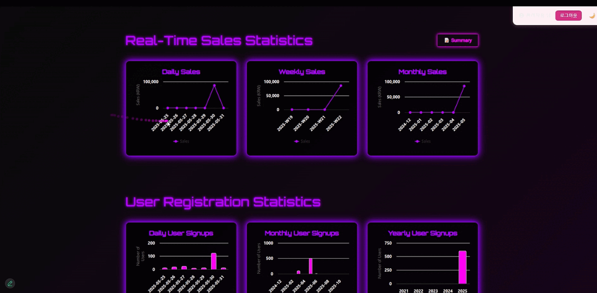

&nbsp;

## **📊 WBS (Work Breakdown Structure)**

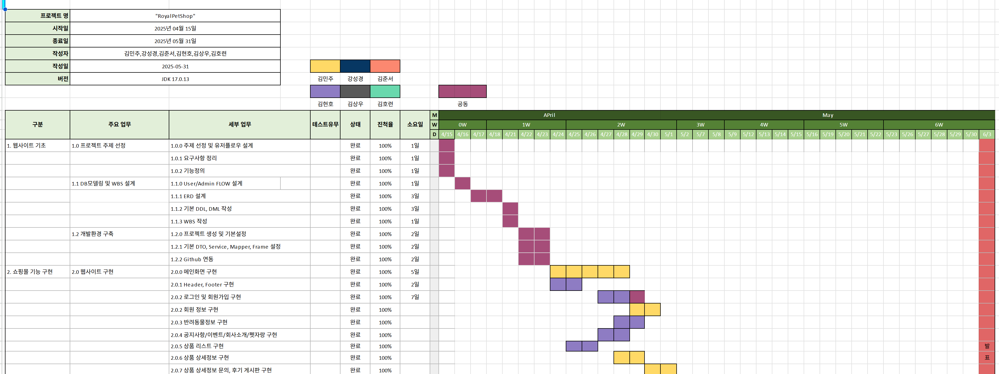

- [🚗 Visit WBS](https://docs.google.com/spreadsheets/d/1WaKkOoaokv8sxJsjjT0YFSjdwtI9_H0zxr2BZEEwtgI/edit?gid=130692905#gid=130692905)

&nbsp;

## **🚀 USER-FLOW**

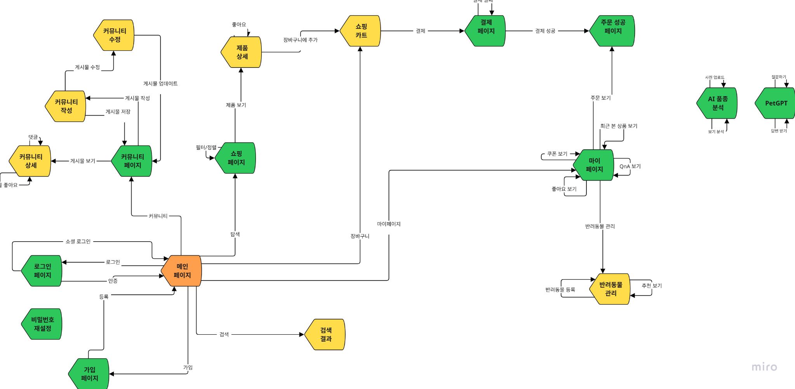

&nbsp;

## **🚀 ADMIN-FLOW**

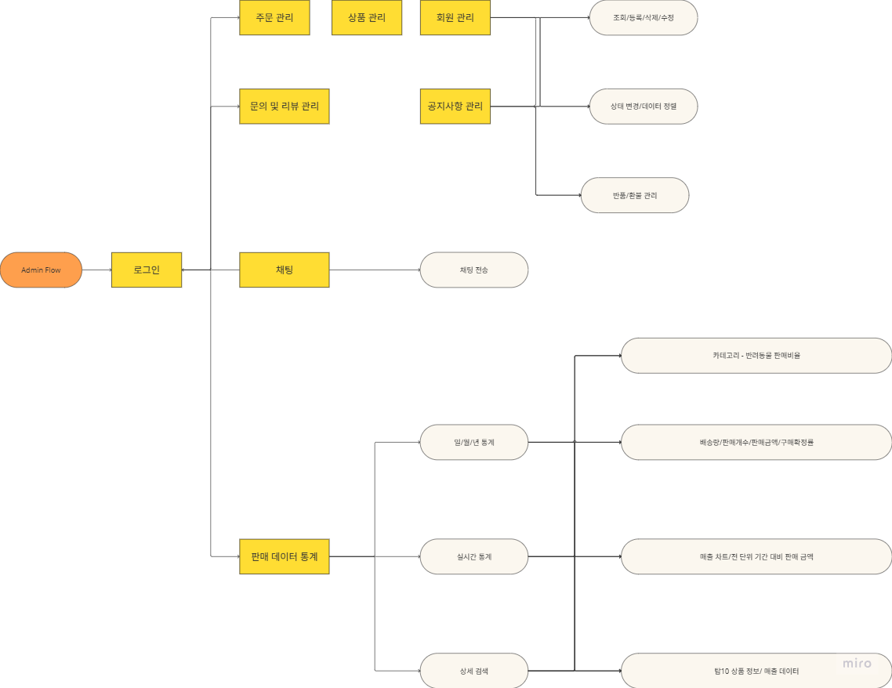

&nbsp;

## **🤔 트러블 슈팅 (Troubleshooting)**

- **김민주**:

  - **문제 1**: 화면에서 이미지가 로드되지 않음
    - **원인**: jQuery의 로딩 시점(선/후)에 따라 스크립트 실행 여부가 달라질 수 있음
    - **해결**: 이미지가 JS(jQuery)로 동적으로 로드되는 구조라면, jQuery가 반드시 먼저 로드되어야 함
  - **문제 2**: 잘 사용하던 annotation이 갑자기 오류를 일으킴
    - **원인**: 캐시삭제가 제대로 되지 않음
    - **해결**: 인텔리제이에서 'invalidate cashes'를 선택해 재시작
  - **문제 3**: 문의글에서 주문내역 선택 상자가 두 개 나타나는 오류 발생
    - **원인**: select 태그 하나에 Select2, NiceSelect가 모두 적용되어 중복으로 나타남
    - **해결**: 해당 셀렉트박스에 niceSelect()가 적용되지 않도록 코드 작성

- **김준서**:

  - **문제 1**: 관리자 페이지에 particles.js를 이용해 파티클이 내리는 효과를 추가하려 했지만, 효과가 화면에 나타나지 않음.
    - **원인**: particles.min.js 스크립트가 로드되지 않음
      CDN 경로 누락 또는 인터넷 연결 문제
      <div id="particles-js">가 페이지에 없음
      JavaScript가 렌더링되기 전에 엘리먼트를 찾지 못함
      CSS 설정 누락으로 입자가 보이지 않음
      z-index, position, width, height 미지정
      스크립트가 <body>보다 먼저 실행됨
      DOM이 준비되기 전에 실행되어 canvas가 생성되지 않음
    - **해결**: 구현하지 못함

- **김상우**: 
    - **문제 1**: 주문상세 페이지 로딩 후 콘솔에 “DataTables warning: table id=totalOrderTable – Incorrect column count” 오류가 발생하여 데이터가 페이지에 출력되지 않는 현상이 발생했다.
        - **원인**: 요약 테이블 아래에 “상세” 토글용 <tr class="detail-row"> 를 JSP에서 그대로 남겨두면, DataTables가 헤더(thead) 열 개수(7개)와 실제 <tbody> 행의 <td> 개수(달라짐)를 비교하면서 경고를 출력하였다.
        - **해결**: 요약 행(<tr>…</tr>)만 남기고, detail-row 관련 <tr> 요소는 모두 지운
          다.
          대신 JavaScript의 row.child() API를 사용해 “클릭 시 동적으로 한 줄(span)처럼 펼쳐지는” 방식으로 변경하여 해결을 하였다.

    - **문제 2**: 관리자 채팅 화면에서 “나에게” 메시지를 보냈을 때 입력된 텍스트는 사라지지만, 채팅 박스(#me 영역)에는 전혀 출력되지 않는다.
      - **원인**: 구독(Subscription) 호출이 잘못된 컨텍스트(context)에서 실행됨
      - **해결**: STOMP 클라이언트 인스턴스를 올바르게 참조하여 구독하여 해결하였다.
- **김현호**:

  - **문제**: AI 챗봇이 사용자의 질문 의도와는 다소 거리가 있거나 관련성이 낮은 정보를 포함하여 답변하는 경우가 발생했습니다. 특히, 쇼핑몰 내부 특정 상품 정보나 정책 관련 질문에 대해 기대만큼 정확한 답변을 제공하지 못했습니다.

    - **원인**: 벡터 스토어에 문서를 저장하고 임베딩할 때 사용한 청크(chunk)의 크기 및 분할 전략이 부적절했습니다. 초기에는 문서의 의미적 단위를 넓게 가져가기 위해 청크를 매우 크게 설정했습니다. 이 경우, 개별 청크가 너무 많은 정보를 포괄하게 되어 검색 시 특정 질문과 관련된 핵심 내용의 정확도가 오히려 떨어지고, 관련 없는 정보까지 함께 참조하여 답변을 생성하는 경향이 있었습니다. 반대로, 정보의 정확도를 높이고자 청크를 문장 단위 등으로 매우 잘게 분할했을 때는 개별 청크가 충분한 컨텍스트를 담지 못했습니다. 이로 인해 여러 청크에 분산된 정보를 종합적으로 이해하고 답변을 생성하는 데 어려움이 있었으며, 단편적이거나 맥락이 부족한 답변이 생성되었습니다.

    - **해결**: 다양한 청크 크기(예: 문서 전체, 문단 단위, 특정 토큰 수 기준, 문장 단위)와 분할 전략(고정 길이, 의미 기반 분할 등)을 실험적으로 적용하며 답변 품질을 지속적으로 비교 평가하여 문제를 해결했습니다.

&nbsp;

## **💡 프로젝트를 통해 배운 점 및 느낀 점**

- **강성경**: petgpt프로젝트는 기간내내 즐거운 작업이었다.
  팀원들 모두, 각자의 자리에서 열심히 최선을 다했고, 수다떨며 서로에 대해 알아가는 시간도 도 좋았다.
  무엇보다 팀원들 모두 코딩이 정말 즐거워보였다.
  아침마다 팀원들의 깃 브랜치에는 새로운 시도와 결과물이 가득했다.
  정말 한창 진행중일때 우리는  밤에코딩하기없기!! 를 서로 외칠정도로 열심이었다.
  나는 그들이 즐겁게 작업했음을 안다.
  나는 개인 일정으로 많은 시간을 할애하지못했는데,
  그런 상황을 이해해주고 배려해주는 팀원들에게 정말 고마웠다.
  팀원들이 chatgpt를 활용해서 공부하고 프로젝트구현에 활용하는 부분을 보며 , 공부법에 대해서도 많이 배웠다.
  나는 우리 팀원들이 자랑스럽고, 감사하다.

- **김민주**: 이번 프로젝트는 처음으로 직접 참여한 프로젝트였기 때문에 초반에는 모든 것이 낯설고 어려웠지만 시간이 지날수록 점점 애정이 생기고 흥미도 커졌습니다. 제가 구상한 대로 웹사이트를 디자인하고 기능을 구현하는 과정은 생각했던 것보다 훨씬 재미있고 보람 있었습니다.
또한 두 달 동안 필요한 기술들을 찾아보고 공부하며 하나씩 기능을 완성해 나가는 과정 자체가 큰 자산이 되었습니다. 이 경험을 통해, 중요한 것은 어떤 기술을 이미 알고 있느냐보다 목표를 이루기 위해 어떻게/무엇을 배우고자 했으며, 그 기술을 얼마나 효율적으로 체득하느냐는 점이라는 것을 깨달았습니다.
마지막으로, 두 달이라는 긴 시간 동안 함께 고민하고 노력해준 팀원들에게 진심으로 감사드립니다. 혼자였다면 결코 완성할 수 없었을 이 프로젝트를 함께 만들어가면서, 협업의 중요성과 서로에 대한 배려, 존중의 가치를 많이 배울 수 있었습니다.

- **김준서**:
  이번 프로젝트를 통해 단순한 기능 구현을 넘어서, 실제 사용자 관점에서 문제를 정의하고 해결하는 과정의 중요성을 깊이 체감할 수 있었습니다. 초기 설계 단계에서 요구사항을 명확히 정의하고, 그에 맞게 구조화된 코드를 작성하는 것이 유지보수성과 확장성 측면에서 얼마나 중요한지를 배웠습니다.

  또한 팀원들과의 협업 과정에서 버전 관리(Git), 이슈 트래킹, 코드 리뷰 등의 개발 문화가 프로젝트 완성도에 직접적인 영향을 미친다는 것을 느꼈습니다. 특히 의사소통과 역할 분담이 원활할수록 개발 속도와 품질이 향상된다는 점을 실감했습니다.

  무엇보다도 프로젝트를 통해 "완성된 서비스를 직접 운영해보는 경험"이 주는 자신감과 동기부여가 가장 큰 수확이었습니다. 이번 경험을 바탕으로 앞으로도 더욱 적극적이고 주도적으로 개발에 임하고 싶습니다.

- **김상우**: 프로젝트를 함께해 준 팀원 여러분께 먼저 깊은 감사의 말씀을 전합니다. 이번 첫 번째 프로젝트를 통해 가장 크게 느낀 점은, 목표와 방향을 충분히 공유하지 않으면 서로 다른 기대치로 인해 엇박자가 날 수 있다는 것입니다. 프로젝트 초반에 각자가 생각하는 기대 결과와 진행 방식을 자유롭게 제안하며 의견을 나눴습니다. 이 과정에서 목표는 같다고 해도 표현 방식이나 우선순위에 차이가 있을 수 있다는 사실을 깨달았고, 서로의 관점을 이해하며 조율하는 자체가 곧 프로젝트의 핵심이라는 것을 체감했습니다.
모두가 자유롭게 키워드와 아이디어를 던지면, 다른 팀원은 장단점을 고민하며 필요한 자료를 공유했습니다. 실시간으로 의견을 주고받으면서 서로의 생각이 어떻게 발전하는지 눈으로 확인할 수 있었고, 덕분에 팀워크가 더욱 단단해졌습니다. 역할을 분명히 분담하되, 서로 돕고 겹치는 부분에 대해서는 언제든 협업할 수 있어야 효율이 극대화된다는 점도 배웠습니다.
또한, 문제 앞에서 포기하지 않는 노력과 적극적인 도움 요청의 중요성도 절실히 느꼈습니다. 오류나 어려움이 생길 때마다 질문을 던지고 도움을 청하자, 경험 있는 팀원이 상세한 조언과 자료를 아낌없이 공유해 주었습니다. 서로의 약점을 보완해 주고, 어려울 때는 주저 없이 손을 내밀 수 있는 신뢰가 있기에 문제를 빠르게 해결할 수 있었습니다.
결국 이번 프로젝트를 통해 확인한 가장 큰 교훈은 ‘협업’과 ‘노력’이 서로 시너지를 낼 때야 비로소 좋은 성과를 얻을 수 있다는 점입니다. 앞으로도 어떤 프로젝트를 맡든, 지속적으로 의견을 나누고 서로의 부족한 부분을 메워 주는 협업 정신을 한층 더 발전시켜 나가겠습니다.

- **김현호**:
  본 프로젝트의 기획부터 구현, 마무리까지 전 과정을 직접 수행하면서, 다음 프로젝트에서는 초기 기획 단계의 중요성을 깊이 인식하게 되었습니다. 특히 데이터베이스 구조를 설계하고, 각 기능의 세부 내용을 미리 잘 정리해두는 것이 개발 과정에서 발생할 수 있는 시행착오를 줄이고 전체적인 효율을 높이는 데 도움이 된다는 점을 깨달았습니다.

  또한 Google Vision API나 외부 챗봇처럼 인공지능 관련 서비스를 실제 애플리케이션에 연결해보면서, 새로운 기술에 대한 이해도를 높일 수 있었습니다. 이러한 경험은 앞으로 더 유용하고 실질적인 가치를 주는 서비스를 기획하고 개발하는 데 큰 도움이 될 것이라 기대합니다.

  마지막으로, 프로젝트를 진행하면서 Langchain이나 RAG 같은 새로운 기술을 직접 배우고 바로 적용해보는 과정은 단순한 이론 공부보다 더 몰입감 있게 느껴졌으며, 실제로 기술을 익히는 데 더 효과적이었습니다. 이를 통해 실전 중심의 학습 방식이 매우 유익하다는 점을 느꼈습니다.
